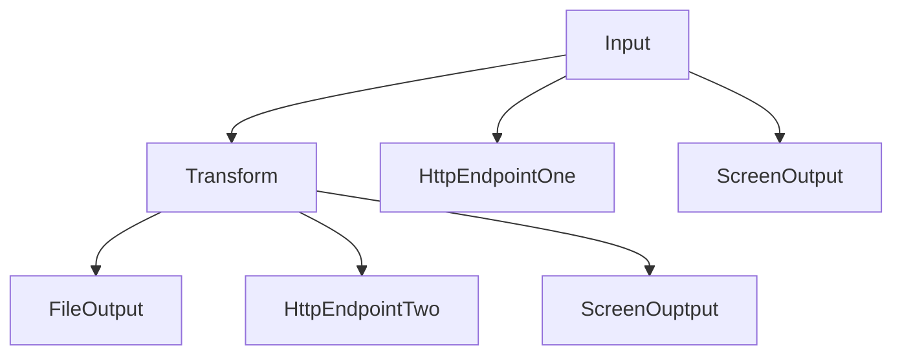

### Quick, EZ operation

`python __muse_monitor.py__ --EZ --osc`

This operation will automatically do a few things in sequence. 

1.  Find the USB address of the BLED112 device
2.  Find the Muse (must be in connection mode) with the BLED device
3.  Start streaming to the default OSC port for TouchDesigner or other uses


### data flow

send data from an input -> transform -> output

```python

from eegstreamer.inputs import RandomEEGInputStream
from eegstreamer.transforms import ConstantFactorEEGTransformer
from eegstreamer.outputs import JSONFileOutputStreamer

# create the output stream
output_stream = JSONFileOutputStreamer('eeg_output.json')

# create the stream to transform the data
transform_stream = ConstantFactorEEGTransformer(factor=0.2)
# tell the transform stream where to send its data
transform_stream.connect(output_stream)

# create the input stream
input_stream = RandomEEGInputStream(sample_rate=10, sample_duration=10)
# tell the input stream where to send its data
input_stream.connect(transform_stream)

# start the input stream
input_stream.start()
```

input can be streamed to multiple endpoints



```python
from eegstreamer.outputs import HttpPostEEGOutputStreamer, JSONFileOutputStreamer
from eegstreamer.transforms import ConstantFactorEEGTransformer
from eegstreamer.inputs import RandomEEGInputStream

endpoint_one = HttpPostEEGOutputStreamer("https://sample.com/rawd")
endpoint_two = HttpPostEEGOutputStreamer("https://sample.com/processed")
file_output = JSONFileOutputStreamer("eeg_output.json")

transformer = ConstantFactorEEGTransformer(factor=10)
transformer.connect(file_output)
transformer.connect(endpoint_two)

input_stream = RandomEEGInputStream(sample_rate=10, sample_duration=10)
input_stream.connect(transformer)
input_stream.connect(file_output)

input_stream.start()
```

# Development

Due to new requirements for packaging python modules, the following command needs to be run
prior to doing development:

`pip install -e .`

This creates a symbolic link so that python knows that the `eegstreamer` package
can be found underneath the `src` directory.

Also, requirements are now part of the pyproject.toml file, so this will
also install the latest dependencies.


If you also want to use the behave testing framework for development, this will
install the extra dependencies needed:

`pip install -e .'[dev]'`

# Muse device

`brew install labstreaminglayer/tap/lsl`
`pip install -e .'[muse]'`

# Known issues

1. If two applications try to connect to the same muse device. The thread running inside bgapi throws an exception with no way of catching it.
2. The system will run usually for about 20-30 min. If headset disconnects mid stream (?), just re-run the script
3. We have seen an error where everything will be physically connected but the Muse will not connect. In those instances, disconnect and re-seat all physical connections (i.e. USB) 